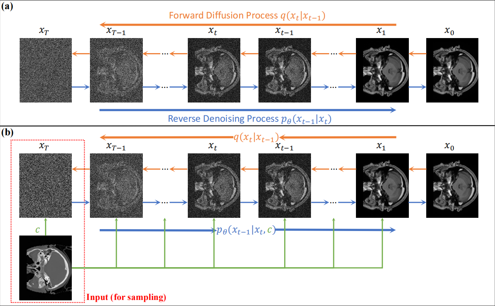

# MaDiUNet: Mamba-Enhanced UNet Denoising Model for CT-MRI Diffusion Imaging
## 📌 Overview
**MaDiUNet (Mamba-Enhanced UNet Denoising Model)** is a diffusion-based framework for cross-modal CT-MRI medical image translation. Built upon a conditional difference-domain diffusion formulation, MaDiUNet focuses on learning the residual information between the conditioned and target images, reducing the modality gap and improving synthesis stability. To enhance global anatomical modeling, the framework integrates Mamba-based Selective State-Space Modules into the UNet denoiser, enabling efficient long-range dependency modeling with linear complexity. Experiments on multiple CT-MRI datasets demonstrate that MaDiUNet improves image fidelity, preserves structural details, and achieves a better balance between generation quality and computational efficiency.

The overview of MaDiUNet:


The diffusion process:


### ✨ Key Features

- **Difference-Domain Diffusion**: Learns residual information between the conditional and target images instead of directly synthesizing the target modality.
- **Mamba-Enhanced UNet**: Integrates Mamba-based Selective State-Space Modules into the UNet denoiser to capture long-range anatomical dependencies efficiently.
- **Efficient Global Modeling**: Processes 2D feature maps as sequences, enabling global context modeling with linear computational complexity.
- **CT-MRI Translation**: Supports bidirectional cross-modality medical image translation between CT and MRI.

  

## 🛠️ Installation
### Requirements
- Python 3.12+
- PyTorch 2.4.1+

### Setup
Clone the repository and install dependencies:
```bash
git clone https://github.com/midisec/Med-D3CG.git
cd Med-D3CG
pip install -r requirements.txt
```

---

## 🚀 Usage
To prepare the dataset, organize your data into multiple subfolders, where each subfolder represents a single sample. Each subfolder should contain **two PNG images**:

- One **CT image** (filename starting with `"ct"`).
- One **MRI image** (filename starting with `"mri"`).

```
dataset/
│── sample1/
│   ├── ct_1.png  # CT image
│   ├── mri_1.png      # MRI image
│
│── sample2/
│   ├── ct_2.png
│   ├── mri_2.png
│
│── sample3/
│   ├── ct_3.png
│   ├── mri_3.png
│
│── ...
```

### 1️⃣ Training the Model

```bash
python train.py --model_name mamba_unet --diffusion_name DIFFDDPM --dataset_type ctmri --dataset_train_dir path/to/dataset --dataset_val_dir path/to/dataset --n_epochs 2000 --batch_size 2
```

### 2️⃣ Evaluating the Model

Make sure to set the model file, output folder, and test dataset folder before running the following command

```bash
python pinggu.py
```

---


## 📜 Citation
If you find this work useful, please cite our paper:
```

```